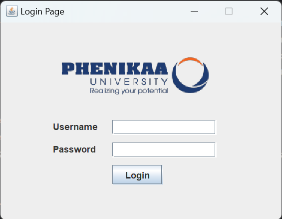
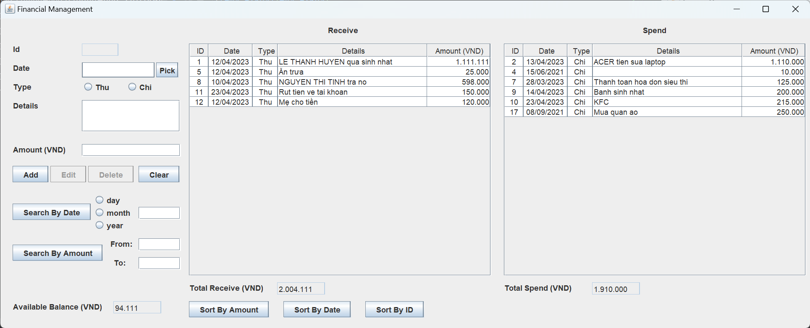
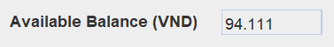
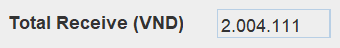
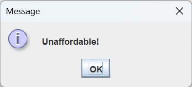
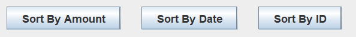
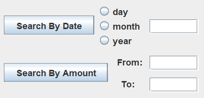

# Bài tập lớn môn Lập trình hướng đối tượng
## Giới thiệu
Bài làm của: Lê Vĩnh Hưng		
MSV: 21011494   
Lớp: K15-KHMT   
Lớp tín chỉ: Lập trình hướng đối tượng-1-2-22(N07)			
Đề: 8. Quản lý thu chi cá nhân

Em xin cam kết bài làm không được chia sẻ với bất kì ai ngoài giáo viên nhằm tránh hành vi sao chép bài.

Lưu ý: Bài làm được thực hiện trên IntelliJ IDEA, có thể sẽ không tương thích hoặc xảy ra lỗi khi chạy trên các IDE khác, mong thầy/cô điều chỉnh giúp em hoặc liên hệ trực tiếp với em qua mail 21011494@st.phenikaa-uni.edu.vn.

## Cấu trúc bài làm
### Về phần file exe trong tệp nén

Sau khi giải nén, người dùng sẽ thấy những file như sau:

- File khởi động: ***Financial.exe***
- Cơ sở dữ liệu: ***financial.xml***
- Để chạy được file exe, thiết bị phải được tải sẵn JDK và JRE ở phiên bản mới nhất, trong tệp nén đã có chứa sẵn link dẫn tới trang web có thể tải 2 phần mềm này.
	+ Sau khi tải, hãy chắc chắn chúng được cài đặt tới đường dẫn "C:\Program Files (x86)\Java".
    + Sau khi cài đặt thành công 2 phần mềm, mở "Edit the system environment variables", chọn "Environment Variables...", điền đường dẫn đến thư mục "_bin_" của 2 phần mềm trên vào mỗi mục PATH của cửa sổ hiện ra (hãy để đường dẫn của JDK 20 ở trên JRE 1.8 nhằm đảm bảo sự ưu tiên).

### Về phần code trên GitHub

Toàn bộ chương trình được chứa trong trong thư mục "_src_", trừ cơ sở dữ liệu được chưa cạnh "_src_".

- File khởi động: ***App.java***
- Cơ sở dữ liệu: ***financial.xml***
- Các package chứa các file quản lý những hạng mục khác nhau:
	+ Package _controller_: chứa logic chính của chương trình, bao gồm logic quản lý danh sách thu/chi và logic đăng nhập cho người dùng.
	+ Package _dao_: chứa các phương thức truy cập, đọc, thêm, sửa, xóa, sắp xếp dữ liệu.
	+ Package _entity_: chứa các phương thức khởi tạo, đọc, thêm, sửa, xóa đối tượng.
	+ Package _utils_: chứa các phương thức đọc và ghi file XML.
	+ Package _view_: chứa các chương trình tạo giao diện
### Hướng dẫn sử dụng chương trình
#### Khởi động
Sau khi chạy file ***App.java*** hoặc file ***Financial.txt***, chương trình sẽ mở giao diện Login như sau:

> Vì đây là thông tin cá nhân, ta cần đăng nhập với tài khoản và mật khẩu nhằm đảm bảo tính bảo mật. Theo mặc định, tên tài khoản là "_username_"  và mật khẩu là "_password_". Nếu có mong muốn thay đổi, truy cập file ***UserDao.java*** theo đường dẫn ".../src/main/java/vn/viettuts/qlsv/dao/UserDao.java", thay đổi "username" thành **String** chứa tên tài khoản mong muốn và thay đổi "password" thành **String** chứa mật khẩu mong muốn.
>
> 

Nhập tài khoản và mật khẩu của bạn và nhấn Login. Nếu nhập sai, chương trình sẽ thông báo:

#### Đăng nhập thành công
Sau khi nhập đúng tài khoản, mật khẩu và nhấn Login, giao diện Login sẽ đóng lại và chương trình tự động mở giao diện quản lý giao dịch:

>Khi giao diện được mở, chương trình sẽ tự động truy cập vào cơ sở dữ liệu, tính "_Available Balance (VND)_", "_Total Receive (VND)_" và "_Total Spend (VND)_" sau đó điền vào các mục cùng tên, các mục này người dùng không thể truy cập cũng như sửa đổi trực tiếp nhưng sẽ tự động cập nhật khi có những thay đổi về hiển thị bảng.
>
> 
> 
> 
> 
> 

#### Bảng danh sách giao dịch
Bảng hiển thị các các đối tượng giao dịch, khi thực hiện các chức năng của chương trình, bảng này cũng sẽ tự động cập nhật theo.

#### Thao tác thêm, sửa, xóa các đối tượng giao dịch

##### Thêm
- Nhấn nút "**Pick**" để mở của sổ lịch, chọn ngày, tháng, năm mong muốn.
- Chọn loại giao dịch ở mục "_Type_".
- Điền thông tin giao dịch, lời nhắn (nếu có) vào mục "_Details_".
- Điền lượng tiền muốn giao dịch vào mục "_Amount_".
- Nhấn nút "**Add**" để thực hiện thêm giao dịch.
- Nếu giao dịch hợp lệ, bảng danh sách giao dịch tự động cập nhật và chương trình hiện thông báo giao dịch thành công.
- Nhấn nút "**Clear**" để xóa các thông tin trên các thanh ghi và thực hiện thao tác tiếp theo.

> Nếu giao dịch mới khiến lượng tiền chi ra lớn hơn thu vào thì chương trình sẽ hiện thông báo và hủy thao tác đó.
> 
> 
##### Sửa
- Chọn mục cần sửa trên bảng danh sách giao dịch.
- Thông tin về giao dịch đó sẽ tự động được điền vào các mục tương ứng.
- Thay đổi những thông tin mong muốn.
- Nhấn nút "**Edit**" để thực hiện thay đổi thông tin giao dịch.
- Nếu thay đổi hợp lệ, bảng danh sách giao dịch tự động cập nhật và chương trình hiện thông báo thay đổi thành công.
- Nhấn nút "**Clear**" để xóa các thông tin trên các thanh ghi và thực hiện thao tác tiếp theo.

> Nếu giao dịch mới khiến lượng tiền chi ra lớn hơn thu vào thì chương trình sẽ hiện thông báo và hủy thao tác đó.
>
> 
##### Xóa
- Chọn mục cần xóa trên bảng danh sách giao dịch.
- Thông tin về giao dịch đó sẽ tự động được điền vào các mục.
- Nhấn nút "**Delete**" để thực hiện xóa giao dịch.
- Nếu thao tác xóa hợp lệ, bảng danh sách giao dịch tự động cập nhật và chương trình hiện thông báo xóa thành công.
- Nhấn nút "**Clear**" để xóa các thông tin trên các thanh ghi và thực hiện thao tác tiếp theo.

> Nếu giao dịch mới khiến lượng tiền chi ra lớn hơn thu vào thì chương trình sẽ hiện thông báo và hủy thao tác đó.
>
> 
#### Thao tác sắp xếp các đối tượng trong bảng
Chương trình chứa 3 chế độ sắp xếp:
- Sắp xếp theo lượng tiền của giao dịch (_Sort By Amount_)
- Sắp xếp theo thời điểm thực hiện giao dịch (_Sort By Date_)
- Sắp xếp theo ID (_Sort By ID_)

#### Thao tác tìm kiếm đối tượng (Thống kê thành bảng)
Chương trình chứa 2 chế độ tìm kiếm:
- Tìm kiếm theo thời điểm thực hiện giao dịch (_Search By Date_)
- Tìm kiếm theo lượng tiền giao dịch (_Search By Amount_)

##### Tìm kiếm theo thời điểm thực hiện giao dịch
- Người dùng chọn các mục "_day_", "_month_", "_year_" tùy theo mong muốn tìm kiếm.
- Người dùng nhập nội dung tìm kiếm và thanh ghi bên phải, nếu đã chọn nhiều hơn 1 mục thì các mục phải ngăn cách nhau bằng dấu "/" và theo thứ tự ngày, tháng, năm.
	+ Ví dụ: Người dùng chọn "_day_" và "_year_" sau đó nhập "4/2023", bảng danh sách giao dịch sẽ hiển thị những giao dịch vào ngày 4 và năm 2023 (có thể xuất hiện nhiều tháng).
- Nhấn nút "**Search By Date**".
- Bảng danh sách giao dịch sẽ tự động hiển thị các giao dịch đạt điều kiện.
- Nhất nút "**Clear**" (tương tư như thao tác nhập, sửa, xóa) để quay lại danh sách giao dịch ban đầu.
> Nếu không tìm thấy kết quả phù hợp, chương trình sẽ hiện thông báo.
>
> 
##### Tìm kiếm theo lượng tiền giao dịch
- Người dùng nhập thông tin về lượng tiền tối thiểu và tối đa vào ô tương ứng.
	+ Nếu người dùng chỉ nhập 1 trong 2 ô, ô còn lại sẽ nhận giá trị mặc định ("_From:_" sẽ nhận 0 và "_To:_" sẽ nhận &infin;)
- Nhấn nút "**Search By Amount**".
- Bảng danh sách giao dịch sẽ tự động hiển thị các đối tượng đạt điều kiện.
- Nhất nút "**Clear**" (tương tư như thao tác nhập, sửa, xóa) để quay lại danh sách giao dịch ban đầu.
> Nếu không tìm thấy kết quả phù hợp, chương trình sẽ hiện thông báo.
> 
> 
