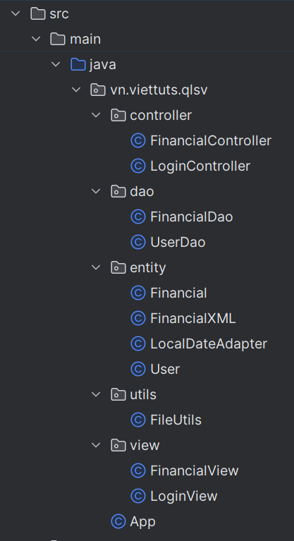
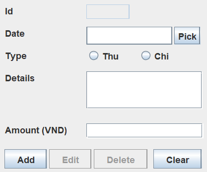
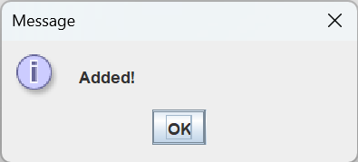
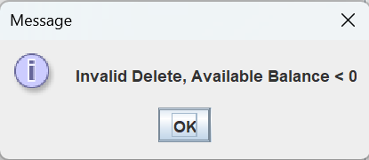

# Bài tập lớn cuối kì 2 năm học 2022-2023
## Giới thiệu
Bài làm của: Lê Vĩnh Hưng
MSV: 21011494   
Lớp: K15-KHMT   
Lớp tín chỉ: Lập trình hướng đối tượng-1-2-22(N07)

Em xin cam kết bài làm không được chia sẻ với bất kì ai ngoài giáo viên nhằm tránh hành vi sao chép bài.

Lưu ý: Bài làm được thực hiện trên IntelliJ IDEA, có thể sẽ không tương thích hoặc xảy ra lỗi khi chạy trên các IDE khác, mong thầy/cô điều chỉnh giúp em hoặc liên hệ trực tiếp với em qua mail 21011494@st.phenikaa-uni.edu.vn.

## Cấu trúc bài làm
Phần code chỉ được chứa trong thư mục "_src_"

- File khởi động: ***App.java***
- Cơ sở dữ liệu: ***financial.xml***
- Các package chứa các file quản lý những hạng mục khác nhau:
	+ Package _controller_: chứa logic chính của chương trình, bao gồm logic quản lý danh sách thu/chi và logic đăng nhập cho người dùng.
	+ Package _dao_: chứa các phương thức truy cập, đọc, thêm, sửa, xóa, sắp xếp dữ liệu.
	+ Package _entity_: chứa các phương thức khởi tạo, đọc, thêm, sửa, xóa đối tượng.
	+ Package _utils_: chứa các phương thức đọc và ghi file XML.
	+ Package _view_: chứa các chương trình tạo giao diện
## Hướng dẫn sử dụng chương trình
### Khởi động
Sau khi chạy file ***App.java***, chương trình sẽ mở giao diện Login như sau:

> Vì đây là thông tin cá nhân, ta cần đăng nhập với tài khoản và mật khẩu nhằm đảm bảo tính bảo mật. Theo mặc định, tên tài khoản là "_username_"  và mật khẩu là "_password_". Nếu có mong muốn thay đổi, truy cập file ***UserDao.java***, thay đổi "username" thành **String** chứa tên tài khoản mong muốn và thay đổi "password" thành **String** chứa mật khẩu mong muốn.
>
> 

Nhập tài khoản và mật khẩu của bạn và nhấn Login. Nếu nhập sai, chương trình sẽ thông báo:

### Đăng nhập thành công
Sau khi nhập đúng tài khoản, mật khẩu và nhấn Login, giao diện Login sẽ đóng lại và chương trình tự động mở giao diện quản lý chi tiêu:

>Khi giao diện được mở, chương trình sẽ tự động truy cập vào cơ sở dữ liệu và tính "_Available Balance (VND)_" và điền vào mục cùng tên, mục này người dùng không thể truy cập cũng như sửa đổi trực tiếp.
>
>

### Bảng danh sách giao dịch

### Thao tác thêm, sửa, xóa các đối tượng chi tiêu

#### Thêm
- Nhập thông tin về ngày thực hiện giao dịch vào mục "_Date_" theo định dạng "ngày/tháng/năm".
- Chọn loại giao dịch ở mục "_Type_".
- Điền thông tin giao dịch, lời nhắn (nếu có) vào mục Details.
- Điền lượng tiền muốn giao dịch vào mục "_Amount_".
- Nhấn nút "**Add**" để thực hiện thêm giao dịch.
- Nếu giao dịch hợp lệ, bảng danh sách giao dịch tự động cập nhật và chương trình hiện thông báo giao dịch thành công.
- Nhấn nút "**Clear**" để xóa các thông tin trên các thanh ghi và thực hiện thao tác tiếp theo.

> Nếu giao dịch mới khiến lượng tiền chi ra lớn hơn thu vào thì chương trình sẽ hiện thông báo và hủy thao tác đó.
> 
> 
#### Sửa
- Chọn mục cần sửa trên bảng danh sách giao dịch.
- Thông tin về chi tiêu đó sẽ tự động được điền vào các mục.
- Thay đổi những thông tin mong muốn.
- Nhấn nút "**Edit**" để thực hiện thay đổi thông tin giao dịch.
- Nếu thay đổi hợp lệ, bảng danh sách giao dịch tự động cập nhật và chương trình hiện thông báo thay đổi thành công.
- Nhấn nút "**Clear**" để xóa các thông tin trên các thanh ghi và thực hiện thao tác tiếp theo.

> Nếu giao dịch mới khiến lượng tiền chi ra lớn hơn thu vào thì chương trình sẽ hiện thông báo và hủy thao tác đó.
>
>
#### Xóa
- Chọn mục cần xóa trên bảng danh sách giao dịch.
- Thông tin về chi tiêu đó sẽ tự động được điền vào các mục.
- Nhấn nút "**Delete**" để thực hiện xóa giao dịch.
- Nếu thao tác xóa hợp lệ, bảng danh sách giao dịch tự động cập nhật và chương trình hiện thông báo xóa thành công.
- Nhấn nút "**Clear**" để xóa các thông tin trên các thanh ghi và thực hiện thao tác tiếp theo.

> Nếu giao dịch mới khiến lượng tiền chi ra lớn hơn thu vào thì chương trình sẽ hiện thông báo và hủy thao tác đó.
>
>
### Thao tác sắp xếp các đối tượng trong bảng
Chương trình chứa 3 chế độ sắp xếp:
- Sắp xếp theo lượng tiền của giao dịch (Sort By Amount)
- Sắp xếp theo thời điểm thực hiện giao dịch (Sort By Date)
- Sắp xếp theo ID (Sort By ID)

### Thao tác tìm kiếm đối tượng (Thống kê thành bảng)
Chương trình chứa 2 chế độ tìm kiếm:
- Tìm kiếm theo thời điểm thực hiện giao dịch (Search By Date)
- Tìm kiếm theo lượng tiền giao dịch (Search By Amount)

>Chức năng tìm kiếm có thể kết hợp với chức năng sắp xếp

#### Tìm kiếm theo thời điểm
- Người dùng nhập thời điểm vào thanh ghi bên cạnh nút "**Search By Date**" (Có thể nhập ngày, tháng hoặc năm, có ngăn cách nhau bằng dấu "/")
- Nhấn nút "**Search By Date**".
- Nếu tìm thấy kết quả phù hợp, bảng danh sách giao dịch sẽ tự động hiển thị các đối tượng đạt điều kiện.
- Nhất nút "**Clear**" (tương tư như thao tác nhập, sửa, xóa) để quay lại danh sách giao dịch ban đầu.

#### Tìm kiếm theo lượng tiền giao dịch
- Người dùng có thể chọn tìm kiếm theo lượng tiền tối đa (Search By Max Amount) hoặc tối thiểu (Search By Min Amount):
	+ Nhập lượng tiền vào thanh ghi bên cạnh chế độ muốn tìm kiếm
    + Nhấn nút tương ứng
- Nếu tìm thấy kết quả phù hợp, bảng danh sách giao dịch sẽ tự động hiển thị các đối tượng đạt điều kiện.
- Nhất nút "**Clear**" (tương tư như thao tác nhập, sửa, xóa) để quay lại danh sách giao dịch ban đầu.
> Nếu không tìm thấy kết quả phù hợp, chương trình sẽ hiện thông báo.
> 
> 